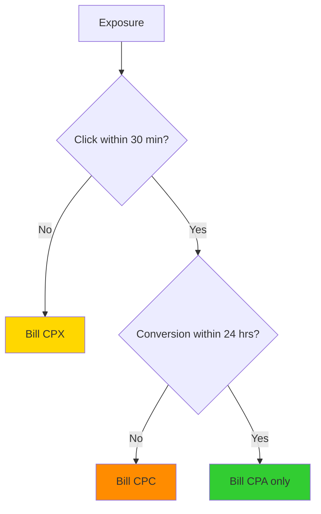

# Understanding Billing Models

AdMesh uses a **three-stage attribution model** that ensures fair, engagement-based pricing. You only pay for actual user engagement, and never pay twice for the same user.

---

## Three-Stage Attribution Model

### Overview

<Steps>
  <Step title="Stage 1: Exposure (CPX)">
    Your product appears in an AI agent's response
    
    **Billing**: Only if user doesn't click within 30 minutes
  </Step>
  
  <Step title="Stage 2: Click (CPC)">
    User clicks on your product link
    
    **Billing**: Only if user doesn't convert within 24 hours
  </Step>
  
  <Step title="Stage 3: Conversion (CPA)">
    User completes desired action (signup, purchase, etc.)
    
    **Billing**: Immediate upon verified conversion
  </Step>
</Steps>

---

## CPX: Cost Per Exposure

### What is CPX?

**Cost Per Exposure (CPX)** is charged when your product is mentioned or recommended in an AI agent's response, but the user doesn't click within the attribution window.

### When You're Charged

- ✅ Product appears in AI response
- ✅ 30 minutes pass (or session ends)
- ✅ User hasn't clicked your product link
- ✅ CPX is billed

### CPX Formula

```
CPX = CPA × 0.001 × (Contextual Relevance Score / 100)
```

**Components**:
- **CPA**: Your offer's cost-per-action (in cents)
- **0.001**: Fixed base rate constant
- **Contextual Relevance Score**: 0-100 metric measuring how well your product matches the query

### Example Calculations

<AccordionGroup>
  <Accordion title="High Relevance Match (CRS: 85)">
    **Scenario**: SaaS product perfectly matches user's query
    
    - CPA: $10.00 (1000 cents)
    - Contextual Relevance Score: 85.0
    - **CPX = 1000 × 0.001 × (85.0 / 100) = 0.85 cents ($0.0085)**
    
    **Result**: You pay less than 1 cent for a highly relevant exposure
  </Accordion>

  <Accordion title="Medium Relevance Match (CRS: 67)">
    **Scenario**: Product is relevant but not perfect match
    
    - CPA: $15.00 (1500 cents)
    - Contextual Relevance Score: 67.3
    - **CPX = 1500 × 0.001 × (67.3 / 100) = 1.01 cents ($0.0101)**
    
    **Result**: You pay about 1 cent for a moderately relevant exposure
  </Accordion>

  <Accordion title="Lower Relevance Match (CRS: 45)">
    **Scenario**: Product is tangentially related to query
    
    - CPA: $3.00 (300 cents)
    - Contextual Relevance Score: 45.8
    - **CPX = 300 × 0.001 × (45.8 / 100) = 0.14 cents ($0.0014)**
    
    **Result**: You pay minimal amount for lower relevance exposure
  </Accordion>
</AccordionGroup>

### Why CPX Matters

- **Brand Visibility**: Compensates for brand awareness even without clicks
- **Fair Pricing**: Cost scales with relevance - better matches cost more, but convert better
- **Quality Signal**: Low CPX indicates poor product-query fit

<Tip>
  Improve your Contextual Relevance Score to reduce CPX costs. [Learn how →](/advertisers/optimization)
</Tip>

---

## CPC: Cost Per Click

### What is CPC?

**Cost Per Click (CPC)** is charged when a user clicks your product link but doesn't convert within the attribution window.

### When You're Charged

- ✅ User clicks your AdMesh tracking link
- ✅ 24 hours pass
- ✅ User hasn't converted
- ✅ CPC is billed

<Note>
  If the user converts within 24 hours, you pay **CPA only** - the CPC charge is waived.
</Note>

### CPC Pricing

CPC is **not calculated** - it's a fixed amount you set when creating your offer.

**Typical CPC Ranges**:
- **SaaS/B2B**: $0.50 - $2.00
- **E-commerce**: $0.25 - $1.00
- **Enterprise**: $2.00 - $5.00

### CPC vs CPX

| Metric | CPX | CPC |
|--------|-----|-----|
| **Trigger** | Exposure without click | Click without conversion |
| **Cost** | ~$0.001 - $0.02 | ~$0.50 - $5.00 |
| **Attribution Window** | 30 minutes | 24 hours |
| **Calculation** | Formula-based | Fixed amount |

---

## CPA: Cost Per Acquisition

### What is CPA?

**Cost Per Acquisition (CPA)** is charged when a user completes your desired conversion action (signup, purchase, lead form, etc.).

### When You're Charged

- ✅ User clicks your AdMesh link
- ✅ User completes conversion action
- ✅ Conversion is verified (via webhook or pixel)
- ✅ Within 24-hour attribution window
- ✅ CPA is billed

### CPA Pricing

CPA is the **full value** you're willing to pay for a conversion. This is the amount you set when creating your offer.

**Typical CPA Ranges**:

| Industry | Typical CPA | Example |
|----------|-------------|---------|
| **SaaS (Free Trial)** | $5 - $20 | $10 per signup |
| **SaaS (Paid Plan)** | $20 - $100 | $50 per paid customer |
| **E-commerce** | 5-15% of AOV | $8 for $80 product |
| **B2B Lead Gen** | $50 - $200 | $100 per qualified lead |
| **Enterprise** | $200 - $1000+ | $500 per demo request |

### Conversion Verification

Conversions must be verified through one of these methods:

<CardGroup cols={3}>
  <Card title="Shopify Webhook" icon="shopify">
    Automatic order webhooks (OAuth integration)
  </Card>
  
  <Card title="Conversion Pixel" icon="code">
    JavaScript pixel on success page
  </Card>
  
  <Card title="Server Webhook" icon="server">
    Server-to-server postback with HMAC verification
  </Card>
</CardGroup>

[Learn more about tracking setup →](/advertisers/tracking-overview)

---

## Single Billing Principle

### You Never Pay Twice

AdMesh ensures you're only billed for the **highest level of engagement** achieved by each user.

### Billing Logic



### Example Scenarios

<AccordionGroup>
  <Accordion title="Scenario 1: Full Conversion Path">
    **Timeline**:
    - 10:00 AM - Exposure (product shown in AI response)
    - 10:05 AM - Click (user clicks link)
    - 12:30 PM - Conversion (user signs up)
    
    **Billing**: **CPA only** ($10.00)
    
    **Reason**: Conversion occurred within 24-hour window, so CPC is waived
  </Accordion>

  <Accordion title="Scenario 2: Click Without Conversion">
    **Timeline**:
    - 10:00 AM - Exposure
    - 10:05 AM - Click
    - 24+ hours pass - No conversion
    
    **Billing**: **CPC only** ($0.50)
    
    **Reason**: No conversion within 24-hour window
  </Accordion>

  <Accordion title="Scenario 3: Exposure Without Click">
    **Timeline**:
    - 10:00 AM - Exposure
    - 30+ minutes pass - No click
    
    **Billing**: **CPX only** ($0.0085)
    
    **Reason**: No click within 30-minute window
  </Accordion>

  <Accordion title="Scenario 4: Late Conversion (Outside Window)">
    **Timeline**:
    - Monday 10:00 AM - Exposure
    - Monday 10:05 AM - Click
    - Wednesday 2:00 PM - Conversion (30+ hours later)
    
    **Billing**: **CPC** ($0.50) + **CPA** ($10.00) = **$10.50**
    
    **Reason**: Conversion occurred outside 24-hour attribution window, so it's treated as a separate event
  </Accordion>
</AccordionGroup>

---

## Attribution Windows

### Default Windows

| Stage | Default Window | Customizable? |
|-------|----------------|---------------|
| **Exposure → Click** | 30 minutes | ✅ Yes |
| **Click → Conversion** | 24 hours | ✅ Yes |

### Customizing Windows

Navigate to **Integration** page in your dashboard to configure attribution windows:

<Steps>
  <Step title="Go to Integration Page">
    Dashboard → Integration
  </Step>
  
  <Step title="Attribution Configuration">
    Scroll to "Attribution Billing Configuration" section
  </Step>
  
  <Step title="Set Windows">
    - **Exposure-to-Click**: 15 min to 2 hours
    - **Click-to-Conversion**: 1 hour to 30 days
  </Step>
  
  <Step title="Save Changes">
    Click "Save Configuration"
  </Step>
</Steps>

<Warning>
  Longer attribution windows increase the likelihood of attributing conversions, but may also attribute conversions that weren't directly influenced by AdMesh.
</Warning>

---

## Budget Management

### How Budget Works

1. **Allocate Budget**: Set total budget when creating an offer
2. **Budget Lock**: Budget is locked and reserved for that offer
3. **Real-time Deduction**: Each engagement (CPX/CPC/CPA) deducts from budget
4. **Auto-pause**: Offer automatically pauses when budget is exhausted

### Budget Tracking

View budget status in your dashboard:

- **Total Allocated**: Initial budget set for offer
- **Total Spent**: Sum of all CPX + CPC + CPA charges
- **Remaining**: Available budget for future engagements
- **Spend Rate**: Average daily spend

### Freeing Budget

To free locked budget:

<Steps>
  <Step title="Pause Offer">
    Change offer status to "Inactive" (budget remains locked)
  </Step>
  
  <Step title="Cancel Offer">
    Change offer status to "Cancelled" (budget is released back to wallet)
  </Step>
</Steps>

---

## Cost Optimization Tips

### Reduce CPX Costs

<CardGroup cols={2}>
  <Card title="Improve Product Data" icon="file-text">
    - Write detailed descriptions
    - Add relevant keywords
    - Choose accurate categories
    - Define target audience
  </Card>
  
  <Card title="Monitor CRS" icon="chart-line">
    - Track Contextual Relevance Score
    - Identify low-performing queries
    - Optimize for high-CRS matches
  </Card>
</CardGroup>

### Improve Conversion Rates

- **Landing Page Optimization**: Ensure landing pages match ad messaging
- **Clear CTAs**: Make conversion actions obvious
- **Fast Load Times**: Reduce page load time
- **Mobile Optimization**: Ensure mobile-friendly experience

### Budget Allocation

- **Start Small**: Begin with $50-$100 to test
- **Monitor Performance**: Track CTR and conversion rate
- **Scale Winners**: Increase budget for high-performing offers
- **Pause Losers**: Stop offers with poor ROI

---

## Dashboard Metrics

Track these key metrics in your dashboard:

| Metric | Description | Where to Find |
|--------|-------------|---------------|
| **Total Spent** | Sum of all CPX + CPC + CPA | Analytics page |
| **CPX Spend** | Total exposure costs | Queries page |
| **CPC Spend** | Total click costs | Queries page |
| **CPA Spend** | Total conversion costs | Analytics page |
| **CTR** | Click-through rate | Offer analytics |
| **Conversion Rate** | Conversions / Clicks | Offer analytics |
| **Cost Per Conversion** | Total Spent / Conversions | Analytics page |

---

## Need Help?

<CardGroup cols={2}>
  <Card title="Contextual Relevance Score" icon="chart-bar" href="/contextual-relevance-score">
    Learn how CRS affects CPX costs
  </Card>
  
  <Card title="Optimization Guide" icon="lightbulb" href="/advertisers/optimization">
    Tips to improve performance and reduce costs
  </Card>
</CardGroup>

