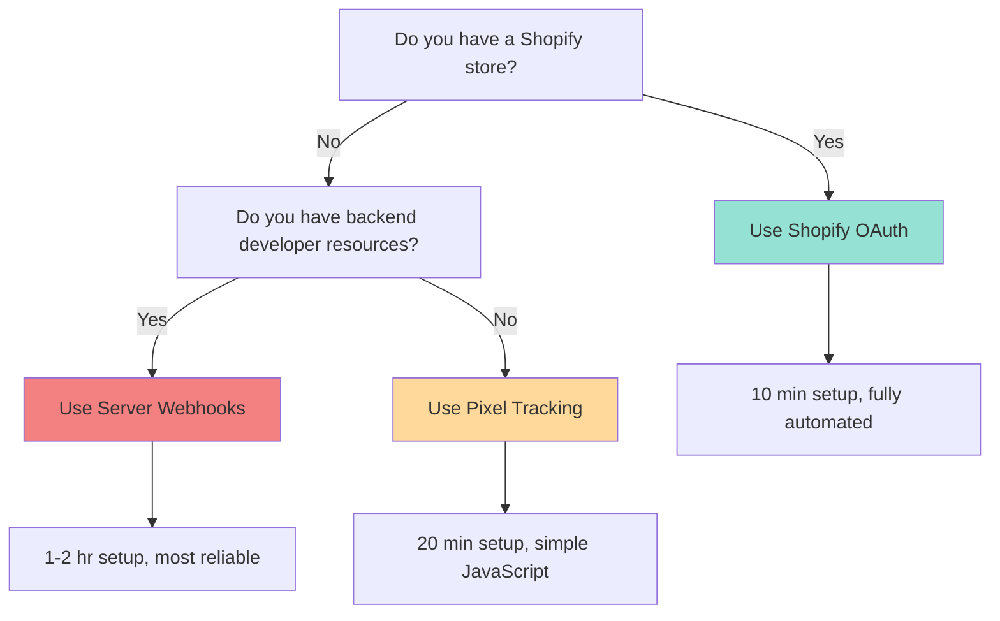

# Tracking & Attribution Setup

AdMesh provides three tracking methods to suit different platforms and technical capabilities. Choose the method that best fits your needs.

---

## Tracking Methods Overview

<CardGroup cols={3}>
  <Card title="Shopify OAuth" icon="shopify" href="/advertisers/tracking-shopify">
    **10 minutes** • No-code
    
    Fully automated for Shopify stores
  </Card>
  
  <Card title="Pixel Tracking" icon="code" href="/advertisers/tracking-pixel">
    **20 minutes** • Copy/paste
    
    JavaScript snippet for SaaS/B2B
  </Card>
  
  <Card title="Server Webhooks" icon="server" href="/advertisers/tracking-webhooks">
    **1-2 hours** • Developer required
    
    Enterprise server-side tracking
  </Card>
</CardGroup>

---

## Comparison Table

| Feature | Shopify OAuth | Pixel Tracking | Server Webhooks |
|---------|---------------|----------------|-----------------|
| **Setup Time** | 10 minutes | 20 minutes | 1-2 hours |
| **Technical Level** | No-code | Copy/paste | Developer required |
| **Conversion Tracking** | Automatic | Client-side | Server-side |
| **Reliability** | ⭐⭐⭐⭐⭐ | ⭐⭐⭐ | ⭐⭐⭐⭐⭐ |
| **Security** | OAuth 2.0 | localStorage | HMAC SHA256 |
| **Best For** | E-commerce | SaaS/B2B | Enterprise |
| **Ad Blocker Resistant** | ✅ Yes | ❌ No | ✅ Yes |
| **Cross-domain** | ✅ Yes | ⚠️ Limited | ✅ Yes |
| **Mobile App Support** | ❌ No | ❌ No | ✅ Yes |

---

## How AdMesh Tracking Works

### 1. Click Tracking (Automatic)

When a user clicks a recommendation, AdMesh automatically:

1. **Records the click** with unique `utm_click_id`
2. **Redirects to your website** with tracking parameters
3. **Starts attribution window** (24 hours for conversion)

**Tracking URL Format**:
```
https://api.useadmesh.com/click/r/{ad_id}?
  utm_click_id=click_abc123&
  utm_source=admesh&
  utm_target=your-product-slug&
  utm_agent=agent_xyz&
  utm_session=sess_123
```

### 2. Conversion Tracking (Your Responsibility)

You need to implement ONE of the three methods to track conversions:

<Steps>
  <Step title="User Lands on Your Site">
    User arrives with `utm_click_id` parameter in URL
  </Step>
  
  <Step title="Store Click ID">
    Your implementation stores the click ID (localStorage, session, database)
  </Step>
  
  <Step title="User Converts">
    User completes desired action (signup, purchase, etc.)
  </Step>
  
  <Step title="Send Conversion Event">
    Your implementation sends conversion event to AdMesh with the click ID
  </Step>
</Steps>

---

## Decision Tree

Use this flowchart to choose the right tracking method:



---

## Method 1: Shopify OAuth

### Best For
- ✅ Shopify stores
- ✅ E-commerce brands
- ✅ No-code setup preference
- ✅ Automatic conversion tracking

### How It Works

<Steps>
  <Step title="Connect Store">
    Enter your Shopify store URL in AdMesh dashboard
  </Step>
  
  <Step title="OAuth Authorization">
    Authorize AdMesh app in Shopify admin (one-click)
  </Step>
  
  <Step title="Automatic Webhooks">
    AdMesh automatically sets up order creation webhooks
  </Step>
  
  <Step title="Click Tracking">
    Order notes contain click IDs for attribution
  </Step>
  
  <Step title="Conversion Recording">
    AdMesh automatically records conversions when orders are created
  </Step>
</Steps>

### Pros & Cons

<CardGroup cols={2}>
  <Card title="Pros" icon="check">
    - Zero code required
    - Fully automated
    - Product data auto-synced
    - Multi-product bundles
    - Secure OAuth 2.0
  </Card>
  
  <Card title="Cons" icon="x">
    - Shopify-only
    - Requires admin access
    - Limited customization
  </Card>
</CardGroup>

[Full Shopify setup guide →](/advertisers/tracking-shopify)

---

## Method 2: Pixel Tracking

### Best For
- ✅ SaaS platforms
- ✅ B2B websites
- ✅ No backend access
- ✅ Quick setup needed

### How It Works

<Steps>
  <Step title="Landing Page Script">
    Add JavaScript to store click ID in localStorage
  </Step>
  
  <Step title="User Converts">
    User completes signup/purchase
  </Step>
  
  <Step title="Success Page Pixel">
    Pixel fires conversion event to AdMesh API
  </Step>
  
  <Step title="Cleanup">
    localStorage is cleared after successful conversion
  </Step>
</Steps>

### Code Example

**Landing Page** (stores click ID):
```html
<script>
  (function () {
    const params = new URLSearchParams(window.location.search);
    const clickId = params.get('utm_click_id');
    const source = params.get('utm_source');
    const target = params.get('utm_target');

    if (clickId && source === 'admesh' && target) {
      const key = `admesh_referral_${target}`;
      localStorage.setItem(key, JSON.stringify({ clickId, source }));
    }
  })();
</script>
```

**Success Page** (fires conversion):
```html
<script>
  (function () {
    const urlPath = window.location.pathname;
    const urlSlug = urlPath.split('/').filter(Boolean).pop() || "YOUR_PRODUCT_SLUG";
    const key = `admesh_referral_${urlSlug}`;
    const data = localStorage.getItem(key);

    if (data) {
      const { clickId } = JSON.parse(data);
      const conversionUrl = `https://api.useadmesh.com/conversion/pixel?click_id=${clickId}`;
      
      fetch(conversionUrl, { method: 'POST' })
        .then(() => localStorage.removeItem(key))
        .catch(err => console.error('AdMesh conversion tracking failed:', err));
    }
  })();
</script>
```

### Pros & Cons

<CardGroup cols={2}>
  <Card title="Pros" icon="check">
    - No backend changes
    - Works with any platform
    - Quick setup (20 min)
    - Easy to test
  </Card>
  
  <Card title="Cons" icon="x">
    - Client-side only
    - Ad blockers may block
    - Requires JavaScript
    - Cross-domain limitations
  </Card>
</CardGroup>

[Full pixel tracking guide →](/advertisers/tracking-pixel)

---

## Method 3: Server Webhooks

### Best For
- ✅ Enterprise brands
- ✅ Backend developer access
- ✅ Maximum reliability needed
- ✅ Server-side verification

### How It Works

<Steps>
  <Step title="Store Click ID">
    Your server stores click ID from URL parameter (database/session)
  </Step>
  
  <Step title="User Converts">
    User completes conversion action
  </Step>
  
  <Step title="Send Webhook">
    Your server sends POST request to AdMesh conversion API
  </Step>
  
  <Step title="HMAC Verification">
    AdMesh verifies webhook signature for security
  </Step>
  
  <Step title="Conversion Recorded">
    AdMesh records conversion and bills CPA
  </Step>
</Steps>

### Code Example

**Python/FastAPI**:
```python
import requests

def track_conversion(click_id: str, conversion_value: float):
    response = requests.post(
        "https://api.useadmesh.com/conversion/log",
        json={
            "utm_click_id": click_id,
            "conversion_value": conversion_value,
            "event_type": "purchase"
        }
    )
    return response.json()
```

**Node.js/Express**:
```javascript
async function trackConversion(clickId, conversionValue) {
  const response = await fetch('https://api.useadmesh.com/conversion/log', {
    method: 'POST',
    headers: { 'Content-Type': 'application/json' },
    body: JSON.stringify({
      utm_click_id: clickId,
      conversion_value: conversionValue,
      event_type: 'purchase'
    })
  });
  return response.json();
}
```

### Pros & Cons

<CardGroup cols={2}>
  <Card title="Pros" icon="check">
    - Server-side reliability
    - HMAC security
    - Ad blocker resistant
    - Full control
    - Mobile app support
  </Card>
  
  <Card title="Cons" icon="x">
    - Requires developer
    - Longer setup time
    - More complex testing
    - Maintenance needed
  </Card>
</CardGroup>

[Full webhook setup guide →](/advertisers/tracking-webhooks)

---

## Testing Your Implementation

### Test Mode

Use `test=true` parameter to test without spending real budget:

```
https://api.useadmesh.com/click/r/{ad_id}?test=true&utm_click_id=...
```

### Verification Checklist

<Steps>
  <Step title="Click Tracking">
    - [ ] Click link with test=true parameter
    - [ ] Verify redirect to your website
    - [ ] Check URL contains utm_click_id
  </Step>
  
  <Step title="Click ID Storage">
    - [ ] Verify click ID is stored (localStorage/database)
    - [ ] Check click ID persists across page navigation
  </Step>
  
  <Step title="Conversion Tracking">
    - [ ] Complete test conversion
    - [ ] Verify conversion pixel/webhook fires
    - [ ] Check dashboard for test conversion
  </Step>
  
  <Step title="Dashboard Verification">
    - [ ] Navigate to Queries page
    - [ ] Filter by "Test Mode"
    - [ ] Verify test click and conversion appear
  </Step>
</Steps>

---

## Attribution Configuration

### Customizing Attribution Windows

Navigate to **Integration** page to configure:

1. **Exposure-to-Click Window**: 15 min to 2 hours (default: 30 min)
2. **Click-to-Conversion Window**: 1 hour to 30 days (default: 24 hours)

### Webhook Configuration

For server-side tracking, configure:

1. **Webhook URL**: Your endpoint to receive conversion events
2. **Webhook Secret**: For HMAC signature verification
3. **Postback URL**: Alternative to webhooks

---

## Troubleshooting

<AccordionGroup>
  <Accordion title="Conversions not tracking">
    **Check**:
    - Click ID is being stored correctly
    - Conversion pixel/webhook is firing
    - Click ID matches in conversion request
    - Conversion is within 24-hour attribution window
    - Not using test mode in production
  </Accordion>
  
  <Accordion title="localStorage not persisting">
    **Solutions**:
    - Ensure same domain for landing and success pages
    - Check browser privacy settings
    - Verify JavaScript is enabled
    - Consider server-side tracking instead
  </Accordion>
  
  <Accordion title="Webhook signature verification failing">
    **Check**:
    - Using correct webhook secret
    - HMAC calculation matches AdMesh format
    - Request body is not modified before verification
    - Using SHA256 algorithm
  </Accordion>
</AccordionGroup>

---

## Next Steps

<CardGroup cols={2}>
  <Card title="Shopify Setup" icon="shopify" href="/advertisers/tracking-shopify">
    Complete Shopify OAuth integration guide
  </Card>
  
  <Card title="Pixel Setup" icon="code" href="/advertisers/tracking-pixel">
    Detailed pixel tracking implementation
  </Card>
  
  <Card title="Webhook Setup" icon="server" href="/advertisers/tracking-webhooks">
    Server-side webhook integration guide
  </Card>
  
  <Card title="Dashboard Analytics" icon="chart-bar" href="/advertisers/dashboard-analytics">
    Learn what metrics you can track
  </Card>
</CardGroup>

