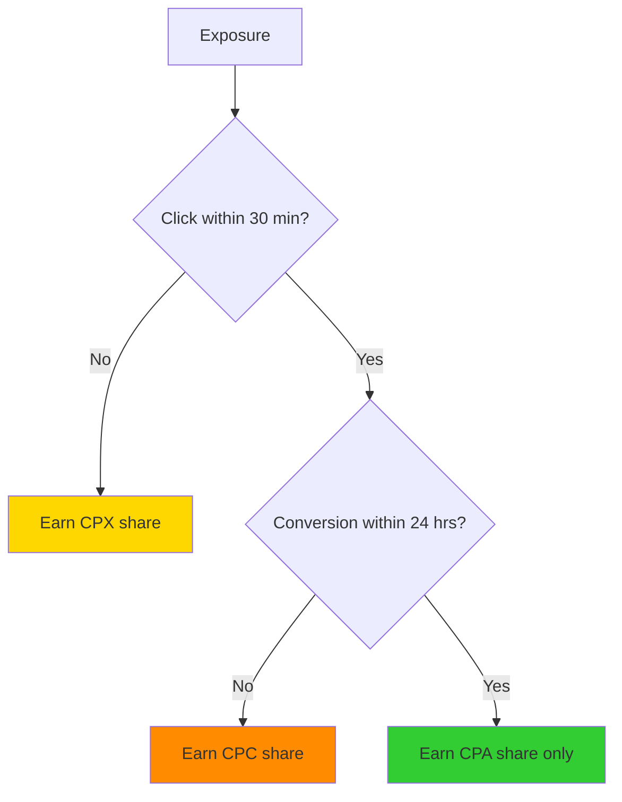

# Earnings Model & Revenue Share

Learn how AdMesh pays AI platforms for displaying recommendations and driving user engagement.

---

## How You Earn

### Three Revenue Streams

You earn a share of what advertisers pay for each engagement level:

| Engagement | Advertiser Pays | You Earn (50%) | Example |
|------------|-----------------|----------------|---------|
| **Exposure** | CPX (~$0.008) | ~$0.004 | User sees recommendation |
| **Click** | CPC (~$0.50) | ~$0.25 | User clicks link |
| **Conversion** | CPA (~$10.00) | ~$5.00 | User signs up/purchases |

<Note>
  Default revenue share is **50%**. High-volume partners may negotiate custom splits.
</Note>

---

## Revenue Share Model

### Default Split: 50/50

```
Your Earnings = Total Engagement Value × 50%
```

**Example Calculation**:
- Advertiser pays CPA: $10.00
- AdMesh platform fee: $5.00 (50%)
- **Your earnings**: $5.00 (50%)

### Custom Revenue Shares

Available for partners with:
- **High Volume**: 10,000+ queries/month
- **High Quality**: Average CRS > 75
- **High Conversion**: CVR > 15%

**Potential Splits**:
- Standard: 50/50
- High Volume: 60/40 (you get 60%)
- Premium: 70/30 (you get 70%)

Contact [mani@useadmesh.com](mailto:mani@useadmesh.com) to discuss custom terms.

---

## Single Billing Principle

### You Earn for Highest Engagement Only

Just like advertisers only pay once, you only earn for the highest engagement level achieved.

**Billing Logic**:



### Example Scenarios

<AccordionGroup>
  <Accordion title="Scenario 1: Full Conversion (Best Case)">
    **Timeline**:
    - 10:00 AM - Exposure (CPX: $0.008)
    - 10:05 AM - Click (CPC: $0.50)
    - 12:30 PM - Conversion (CPA: $10.00)
    
    **Advertiser Pays**: $10.00 (CPA only)
    **Your Earnings**: $10.00 × 50% = **$5.00**
    
    **Note**: You earn CPA share only, not CPX + CPC + CPA
  </Accordion>

  <Accordion title="Scenario 2: Click Without Conversion">
    **Timeline**:
    - 10:00 AM - Exposure
    - 10:05 AM - Click
    - 24+ hours - No conversion
    
    **Advertiser Pays**: $0.50 (CPC only)
    **Your Earnings**: $0.50 × 50% = **$0.25**
  </Accordion>

  <Accordion title="Scenario 3: Exposure Without Click">
    **Timeline**:
    - 10:00 AM - Exposure
    - 30+ minutes - No click
    
    **Advertiser Pays**: $0.008 (CPX only)
    **Your Earnings**: $0.008 × 50% = **$0.004**
  </Accordion>
</AccordionGroup>

---

## Earnings Calculation

### CPX Earnings

CPX is calculated based on Contextual Relevance Score:

```
CPX = CPA × 0.001 × (CRS / 100)
Your CPX Earnings = CPX × Revenue Share %
```

**Example**:
- CPA: $10.00 (1000 cents)
- CRS: 85.0
- CPX: 1000 × 0.001 × (85.0 / 100) = 0.85 cents
- **Your Earnings**: 0.85 × 50% = **0.425 cents ($0.00425)**

### CPC Earnings

CPC is a fixed amount set by the advertiser:

```
Your CPC Earnings = CPC × Revenue Share %
```

**Example**:
- CPC: $0.50
- **Your Earnings**: $0.50 × 50% = **$0.25**

### CPA Earnings

CPA is the full conversion value:

```
Your CPA Earnings = CPA × Revenue Share %
```

**Example**:
- CPA: $10.00
- **Your Earnings**: $10.00 × 50% = **$5.00**

---

## Earnings Potential

### By Query Volume

| Monthly Queries | Avg Earnings/Query | Monthly Earnings |
|-----------------|-------------------|------------------|
| **1,000** | $0.05 | $50 |
| **10,000** | $0.05 | $500 |
| **100,000** | $0.05 | $5,000 |
| **1,000,000** | $0.05 | $50,000 |

<Note>
  Assumes 5% CTR, 15% CVR, $10 CPA. Actual earnings vary by niche and quality.
</Note>

### By Engagement Rate

**Scenario**: 10,000 queries/month, $10 CPA

| CTR | CVR | Conversions | Monthly Earnings |
|-----|-----|-------------|------------------|
| **3%** | 10% | 30 | $150 |
| **5%** | 15% | 75 | $375 |
| **7%** | 20% | 140 | $700 |
| **10%** | 25% | 250 | $1,250 |

**Key Insight**: Higher CTR and CVR dramatically increase earnings.

---

## Payment Terms

### Minimum Payout

- **Threshold**: $50
- **Frequency**: Monthly
- **Method**: Stripe (bank transfer or debit card)

### Payment Schedule

<Steps>
  <Step title="Earnings Accumulate">
    Earnings tracked in real-time in dashboard
  </Step>
  
  <Step title="Month Ends">
    Earnings finalized on last day of month
  </Step>
  
  <Step title="Verification Period">
    7-day verification period for fraud detection
  </Step>
  
  <Step title="Payment Issued">
    Payment sent via Stripe on 7th of following month
  </Step>
</Steps>

**Example Timeline**:
- January 1-31: Earn $150
- February 1-7: Verification period
- February 7: Payment issued to your account

### Payment Methods

- ✅ Bank transfer (ACH, wire)
- ✅ Debit card
- ❌ PayPal (not currently supported)
- ❌ Cryptocurrency (not currently supported)

---

## Tracking Earnings

### Dashboard Analytics

View earnings in your dashboard:

1. **Total Earnings**: Lifetime earnings
2. **Current Month**: Earnings this month
3. **Pending**: Earnings in verification
4. **Paid**: Total paid out

### Earnings Breakdown

| Metric | Description | Where to Find |
|--------|-------------|---------------|
| **CPX Earnings** | Exposure revenue | Analytics page |
| **CPC Earnings** | Click revenue | Analytics page |
| **CPA Earnings** | Conversion revenue | Analytics page |
| **Total Earnings** | Sum of all revenue | Dashboard home |
| **Avg Earnings/Query** | Earnings per query | Analytics page |

### Transaction History

View detailed transaction log:
- Date and time
- Query ID
- Engagement type (CPX/CPC/CPA)
- Amount earned
- Advertiser (anonymized)

---

## Maximizing Earnings

### 1. Increase Query Volume

**Strategies**:
- Grow your user base
- Improve product engagement
- Expand to new use cases
- Optimize for retention

**Impact**: Linear increase in earnings

### 2. Improve Click-Through Rate

**Tactics**:
- Show only high-CRS recommendations (70+)
- Rank by relevance
- Use compelling CTAs
- Add trust signals

**Impact**: 2x CTR = 2x earnings

### 3. Optimize Conversion Rate

**Methods**:
- Filter low-quality recommendations
- Ensure message match
- Target commercial intent queries
- Improve recommendation placement

**Impact**: 2x CVR = 2x earnings

### 4. Focus on High-Value Niches

**High-Paying Categories**:
- B2B SaaS ($20-$100 CPA)
- Enterprise software ($100-$500 CPA)
- Financial services ($50-$200 CPA)
- Professional services ($30-$150 CPA)

**Low-Paying Categories**:
- Consumer apps ($3-$10 CPA)
- E-commerce products ($5-$20 CPA)
- Content subscriptions ($5-$15 CPA)

---

## Earnings Calculator

### Estimate Your Potential

**Formula**:
```
Monthly Earnings = Queries × CTR × CVR × Avg CPA × Revenue Share
```

**Example Calculation**:
- Monthly Queries: 50,000
- CTR: 5% (2,500 clicks)
- CVR: 15% (375 conversions)
- Avg CPA: $10
- Revenue Share: 50%

**Monthly Earnings**: 375 × $10 × 50% = **$1,875**

### Interactive Calculator

Try our earnings calculator: [useadmesh.com/agents#earnings-calculator](https://useadmesh.com/agents#earnings-calculator)

---

## Earnings Optimization Tips

### Do's

<CardGroup cols={2}>
  <Card title="Quality Over Quantity" icon="check">
    - Filter by CRS >= 60
    - Rank by relevance
    - Show 3-5 recommendations max
    - Target commercial intent
  </Card>
  
  <Card title="Track Performance" icon="chart-line">
    - Monitor CTR and CVR
    - Identify top-performing queries
    - A/B test placements
    - Optimize based on data
  </Card>
</CardGroup>

### Don'ts

<CardGroup cols={2}>
  <Card title="Avoid These Mistakes" icon="x">
    - Showing too many recommendations
    - Ignoring CRS scores
    - Modifying tracking links
    - Caching recommendations > 5 min
  </Card>
  
  <Card title="Never Do This" icon="ban">
    - Click fraud or fake clicks
    - Misleading users
    - Hiding disclosure labels
    - Manipulating intent detection
  </Card>
</CardGroup>

---

## Fraud Prevention

### What's Not Allowed

- ❌ **Click Fraud**: Automated or fake clicks
- ❌ **Incentivized Clicks**: Paying users to click
- ❌ **Misleading Placements**: Disguising ads as organic content
- ❌ **Link Manipulation**: Modifying tracking URLs
- ❌ **Bot Traffic**: Non-human traffic

### Consequences

- **First Offense**: Warning and earnings hold
- **Second Offense**: Account suspension
- **Third Offense**: Permanent ban and earnings forfeiture

### Quality Monitoring

AdMesh monitors:
- Click patterns and anomalies
- Conversion rates by platform
- User engagement metrics
- Traffic quality signals

---

## Tax Information

### 1099 Forms (US Partners)

- **Threshold**: $600+ annual earnings
- **Form**: 1099-NEC
- **Delivery**: By January 31st
- **Required**: W-9 form on file

### International Partners

- **Form**: W-8BEN (non-US entities)
- **Withholding**: May apply based on tax treaty
- **Reporting**: Varies by country

<Warning>
  Consult a tax professional for guidance on reporting AdMesh earnings.
</Warning>

---

## Common Questions

<AccordionGroup>
  <Accordion title="When do I get paid?">
    Monthly, on the 7th of the following month, after a 7-day verification period. Minimum payout is $50.
  </Accordion>
  
  <Accordion title="What if I don't reach $50?">
    Earnings roll over to the next month until you reach the $50 minimum threshold.
  </Accordion>
  
  <Accordion title="Can I negotiate a higher revenue share?">
    Yes! High-volume partners (10,000+ queries/month) can contact us for custom terms.
  </Accordion>
  
  <Accordion title="How are earnings calculated for partial conversions?">
    If a user clicks but doesn't convert within 24 hours, you earn CPC share only. If they convert later (outside the window), it's treated as a separate event.
  </Accordion>
  
  <Accordion title="Do I earn for test mode queries?">
    No. Test mode queries (is_test: true) don't count toward earnings.
  </Accordion>
</AccordionGroup>

---

## Next Steps

<CardGroup cols={2}>
  <Card title="Best Practices" icon="lightbulb" href="/ai-platforms/best-practices">
    Optimize for higher earnings
  </Card>
  
  <Card title="Getting Started" icon="rocket" href="/ai-platforms/getting-started">
    Set up your integration
  </Card>
  
  <Card title="Earnings Calculator" icon="calculator" href="https://useadmesh.com/agents#earnings-calculator">
    Estimate your potential
  </Card>
  
  <Card title="Contact Sales" icon="envelope" href="mailto:mani@useadmesh.com">
    Discuss custom revenue share
  </Card>
</CardGroup>

