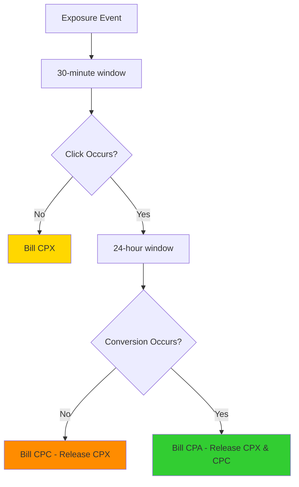

AdMesh implements two distinct pricing models designed specifically for AI-native advertising environments: **CPX (Cost Per Exposure)** and **CPC (Cost Per Click)**. These models differ fundamentally in their billing behavior, making them suitable for different campaign objectives.

<Note>
  **Key Innovation**: Unlike traditional advertising models, AdMesh uses a **cascading attribution system** that ensures brands are **never charged twice** for the same user engagement. The system automatically selects the highest-value engagement and charges only for that, while releasing or waiving lower-value charges.
</Note>

---

## CPX Model: Awareness-Focused Pricing

### Overview

The **CPX Model** is designed for **brand awareness campaigns** where the primary goal is visibility and reach, not immediate clicks or conversions.

### Billing Behavior

<AccordionGroup>
  <Accordion title="1. Exposure (When Recommendation is Shown)">
    - CPX is **charged immediately** when the recommendation is exposed to the user
    - Amount: Based on contextual relevance score (CRS) and campaign settings
    - Timing: Charged after 30-minute attribution window if no click occurs
  </Accordion>

  <Accordion title="2. Click (When User Clicks)">
    - Click is **tracked for analytics** (stored in `clicks` collection)
    - **CPC is set to 0** - no additional charge for clicks
    - CPX charge remains (already charged on exposure)
    - `should_bill_cpc = False`
    - `billing_reason = "CPX_model_no_cpc_charge"`
  </Accordion>

  <Accordion title="3. Conversion (If User Converts)">
    - If conversion occurs, CPA is charged
    - CPX charge is **waived/released** (conversion is higher value)
    - Only CPA is charged
  </Accordion>
</AccordionGroup>

### Use Cases

- **Brand Awareness Campaigns**: Maximize visibility without click risk
- **Predictable Budgeting**: Fixed cost per exposure, no variable click costs
- **Low-Risk Testing**: Test new products or markets with controlled costs
- **Top-of-Funnel**: Build brand recognition before driving conversions

### Advantages

✅ **Predictable Costs**: Know exactly what you'll pay per exposure  
✅ **No Click Risk**: Clicks don't increase costs  
✅ **Analytics Included**: Click tracking still provides valuable insights  
✅ **Lower Barrier**: Easier to justify spend for awareness goals  

### Example Scenario

**User Query:** "What are the best project management tools?"

```
T+0:    Recommendation shown → CPX charged ($0.05)
T+5min: User clicks link → Tracked, but no CPC charge
T+2hrs: User signs up → CPA charged ($10.00), CPX waived

Result: Only $10.00 charged (CPA)
```

---

## CPC Model: Performance-Focused Pricing

### Overview

The **CPC Model** is designed for **performance campaigns** where ROI and conversion tracking are priorities. This model follows a more traditional CPC approach but with AI-native enhancements.

### Billing Behavior

<AccordionGroup>
  <Accordion title="1. Exposure (When Recommendation is Shown)">
    - CPX budget is **reserved** (not charged yet)
    - Budget is held in pending state
    - If no click occurs within 30 minutes, CPX is charged
  </Accordion>

  <Accordion title="2. Click (When User Clicks)">
    - **CPX is released** (waived, returned to available budget)
    - **CPC is charged** instead
    - Amount: Based on agent trust score (typically $0.10-$0.30)
    - `should_bill_cpc = True` (unless duplicate click in session)
    - `billing.components.cpx_released = cpx_value`
  </Accordion>

  <Accordion title="3. Conversion (If User Converts)">
    - If conversion occurs, CPA is charged
    - CPC charge is **waived/released** (conversion is higher value)
    - Only CPA is charged
  </Accordion>
</AccordionGroup>

### Use Cases

- **Performance Campaigns**: Focus on clicks and conversions
- **ROI Optimization**: Pay only when users engage
- **Conversion-Focused**: Maximize qualified traffic
- **Budget Efficiency**: Reserve budget but only charge on engagement

### Advantages

✅ **Pay for Engagement**: Only charged when users click  
✅ **Budget Protection**: CPX reserved but not wasted if click occurs  
✅ **Performance Tracking**: Clear correlation between spend and engagement  
✅ **Industry Standard**: Familiar CPC model with AI enhancements  

### Example Scenario

**User Query:** "Best CRM for small teams"

```
T+0:    Recommendation shown → CPX reserved ($0.05, not charged)
T+5min: User clicks link → CPX released, CPC charged ($0.20)
T+2hrs: User signs up → CPA charged ($10.00), CPC waived

Result: Only $10.00 charged (CPA)
```

---

## Cascading Attribution Model

### Core Principle: Single Billing Guarantee

**AdMesh guarantees that brands are never charged twice for the same user engagement.** The system automatically selects the highest-value engagement and charges only for that.

### Attribution Hierarchy

```
CPA (Highest Value) > CPC (Medium Value) > CPX (Base Value)
```

### Attribution Windows

1. **Exposure → Click**: 30 minutes
   - If click occurs within 30 min: Proceed to click billing
   - If no click: Charge CPX

2. **Click → Conversion**: 24 hours
   - If conversion occurs within 24 hrs: Charge CPA (waive CPC)
   - If no conversion: Charge CPC (waive CPX if applicable)

3. **Conversion**: Immediate
   - Verified via webhook/postback
   - Highest priority billing event

### Billing Flow



---

## Comparison with Industry Standards

### Traditional Advertising Models

| Model | When Charged | Industry Standard |
|-------|-------------|-------------------|
| **CPM** | Per 1,000 impressions | Charge on impression, clicks free |
| **CPC** | Per click | Charge only on click, no impression charge |
| **CPA** | Per conversion | Charge only on conversion, no click/impression charge |

### AdMesh Innovation

| Model | Exposure | Click | Conversion | Innovation |
|-------|----------|-------|------------|------------|
| **CPX Model** | ✅ Charged | ❌ Free (tracked) | ✅ Charged (waives CPX) | Awareness-focused, predictable costs |
| **CPC Model** | ⏸️ Reserved | ✅ Charged (releases CPX) | ✅ Charged (waives CPC) | Performance-focused, budget protection |

### Key Differences

1. **CPX Model ≠ Traditional CPM**
   - CPM: Charges per 1,000 impressions (volume-based)
   - CPX: Charges per verified exposure with intent (quality-based)
   - CPX: Tracks clicks for analytics (CPM typically doesn't)

2. **CPC Model ≠ Traditional CPC**
   - Traditional CPC: No exposure charge/reservation
   - AdMesh CPC: Reserves CPX on exposure, releases on click
   - Both: Charge on click, but AdMesh prevents double-billing

3. **Cascading Attribution**
   - Traditional: Separate billing for each event type
   - AdMesh: Automatic waiver/release of lower-value charges
   - Result: Single billing guarantee, never charged twice

---

## Examples and Scenarios

### Scenario 1: CPX Model - Exposure Only

**Timeline:**
- T+0: Recommendation exposed → CPX charged ($0.05)
- T+5min: User clicks → Tracked, no CPC charge
- T+30min: No conversion → Final billing: CPX only

**Result:** $0.05 charged

---

### Scenario 2: CPX Model - Exposure + Conversion

**Timeline:**
- T+0: Recommendation exposed → CPX charged ($0.05)
- T+5min: User clicks → Tracked, no CPC charge
- T+2hrs: User converts → CPA charged ($10.00), CPX waived

**Result:** $10.00 charged (CPA)

---

### Scenario 3: CPC Model - Click Only

**Timeline:**
- T+0: Recommendation exposed → CPX reserved ($0.05, not charged)
- T+5min: User clicks → CPX released, CPC charged ($0.20)
- T+24hrs: No conversion → Final billing: CPC only

**Result:** $0.20 charged (CPC)

---

### Scenario 4: CPC Model - Click + Conversion

**Timeline:**
- T+0: Recommendation exposed → CPX reserved ($0.05, not charged)
- T+5min: User clicks → CPX released, CPC charged ($0.20)
- T+2hrs: User converts → CPA charged ($10.00), CPC waived

**Result:** $10.00 charged (CPA)

---

### Scenario 5: CPC Model - No Click

**Timeline:**
- T+0: Recommendation exposed → CPX reserved ($0.05, not charged)
- T+30min: No click → CPX charged ($0.05)
- No conversion → Final billing: CPX only

**Result:** $0.05 charged (CPX)

---

## How AdMesh Selects the Model

Your brand-agent's AI (unified reasoning layer) automatically selects the optimal pricing model based on:

- **Query context** — User intent and conversation flow
- **Campaign goals** — Awareness vs performance objectives
- **Budget availability** — Wallet balance and pricing model affordability
- **Market conditions** — Competitive landscape and relevance scores

The selected model is stored in the recommendation as `preferred_pricing_model` and determines billing behavior.

---

## Fallback Behavior

When wallet balance is insufficient for the preferred pricing model, the brand-agent automatically falls back:

1. **Preferred Model**: Try preferred_pricing_model first
2. **Fallback Order**: CPX → CPC (prefers CPX when balance is low)
3. **No-Bid**: If all models fail, send no-bid response

This ensures campaigns can continue even with limited budget, prioritizing lower-cost CPX when possible.

---

## Summary

AdMesh's CPX/CPC billing models represent an **AI-native innovation** that:

1. **Prevents Double-Billing**: Cascading attribution ensures single charge
2. **Supports Multiple Goals**: Awareness (CPX) vs Performance (CPC)
3. **Protects Budget**: Reservation system prevents waste
4. **Provides Flexibility**: LLM selects optimal model per context
5. **Maintains Standards**: Familiar CPC model with enhancements

This approach is **not traditional** but is **purpose-built** for conversational AI environments where intent, context, and verified exposure matter more than raw impressions.

---

## Related Documentation

<CardGroup cols={2}>
  <Card title="Pricing Models" icon="dollar-sign" href="/advertisers/pricing-models">
    Detailed guide to CPX and CPC models for advertisers.
  </Card>
  <Card title="Cost Per Exposure" icon="eye" href="/cost-per-exposure">
    Deep dive into CPX calculation and mechanics.
  </Card>
  <Card title="Budget & Performance" icon="chart-line" href="/advertisers/budget-performance">
    Learn how to optimize your ROI across pricing models.
  </Card>
  <Card title="Contextual Relevance Score" icon="star" href="/contextual-relevance-score">
    Understand how CRS affects CPX pricing.
  </Card>
</CardGroup>

