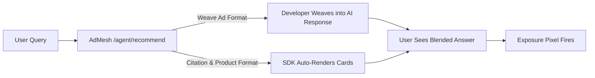

AdMesh offers two powerful integration formats for monetizing AI conversations.
Both support **AI chatbots**, **search assistants**, and **generative LLM applications** — the difference lies in **how much control you want** over the UI and API flow.

---

## Quick Comparison

| Feature | **Weave Ad Format (API)** | **Citation & Product Format (SDK)** |
|----------|----------------------------|-------------------------------------|
| **Integration Type** | API-based | SDK-based |
| **Control** | Full control of UI and placement | Automatic rendering |
| **Ideal For** | Platforms that weave sponsored responses inside AI output | Platforms that display pre-built cards or citations |
| **Rendering** | You decide how, where, and when recommendations appear | SDK auto-renders inside your app |
| **Setup Time** | Moderate (custom rendering) | Minimal (3-step SDK install) |
| **LLM Compatibility** | Perfect for agents that generate natural text | Great for assistants showing answer cards or citations |
| **Tracking** | Manual pixel firing | Automatic via SDK |
| **Transparency Label** | Add `[Ad]` subscript manually | Auto-included in SDK output |
| **Examples** | ChatGPT-style chatbots, voice agents, conversational apps | Search copilots, widgets, dashboards, browser extensions |

---

## How to Choose

Use **Weave Ad Format** if you:
- Want fine-grained UI and conversational control.
- Need to dynamically insert offers into AI-generated text.
- Already have an LLM integration and want programmatic flexibility.

Use **Citation & Product Format** if you:
- Want to integrate quickly with little or no code.
- Prefer AdMesh to handle rendering, labeling, and pixel tracking.
- Are building a chatbot, widget, or extension that surfaces offers or citations visually.

---

## Example Scenarios

| Platform Type | Recommended Format | Why |
|----------------|--------------------|-----|
| **Conversational AI (LLM chat)** | Weave Ad Format | Seamless in-text blending of sponsored links |
| **Search Answer Bot** | Citation & Product Format | Automatically rendered sponsored citations |
| **Browser Extension** | Citation & Product Format | Lightweight, no custom frontend |
| **In-App Chat or Assistant** | Weave Ad Format | Custom UX and interaction control |
| **AI Content Generator** | Weave Ad Format | Natural inclusion inside long-form responses |
| **Widget / Dashboard Plugin** | Citation & Product Format | Quick setup with pre-rendered UI |

---

## Flow Diagram

---

## Recommendation Summary

**Weave Ad Format** → best for custom conversational ads.
You call AdMesh APIs and weave responses directly into your LLM output.
[Learn More → Weave Ad Format](/platforms/weave-ad-format)

**Citation & Product Format** → best for plug-and-play sponsored cards.
You install the SDK and let AdMesh render ads automatically.
[Learn More → Citation & Product Format](/platforms/citation-format)

---

## Next Steps

Start with whichever format suits your integration:

- [Create Session](/platforms/create-session)
- [Get Recommendations](/platforms/get-recommendations)
- [Fire Exposure Pixel](/platforms/fire-exposure-pixel)

