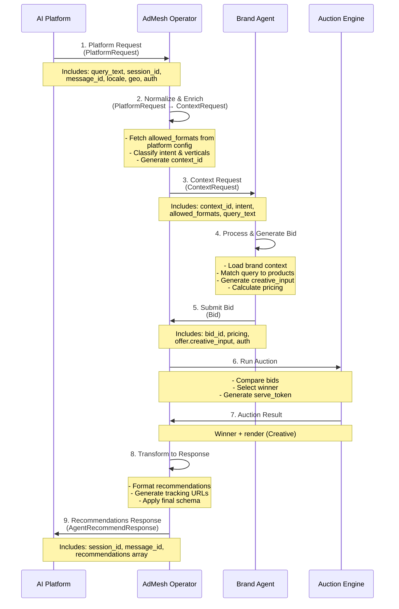

# Complete Flow: Platform Request to Ad Response

This document describes the complete end-to-end flow of how AdMesh processes requests from AI platforms and returns recommendations.

## Flow Overview



## Step-by-Step Flow

### Step 1: Platform Request

The AI platform sends a **Platform Request** to the AdMesh operator.

**Endpoint**: `POST /agent/recommend` (for SDK-based integration)

**Request Schema**: [Platform Request Schema](/platforms/platform-request-schema)

**Key Fields**:
- `request_id`: Unique identifier for this auction request
- `session_id`: Conversation session ID
- `message_id`: **Required** for deduplication
- `query_text`: User's query
- `locale`, `geo`: User location
- `latency_budget_ms`: Optional timing constraint
- `cpx_floor`: Optional minimum CPX requirement
- `auth`: Authentication (nonce + signature)

**Example**:
```json
{
  "request_id": "req_92fA1",
  "session_id": "sess_001",
  "message_id": "msg_sess_001_1234567890_abc123",
  "platform_id": "openai_chat",
  "query_text": "best CRM for small teams",
  "locale": "en-US",
  "geo": "US",
  "timestamp": "2025-11-14T18:22:00Z",
  "latency_budget_ms": 500,
  "auth": {
    "nonce": "nonce_12345",
    "sig": "sig_d41d8cd98f00b204e9800998ecf8427e"
  }
}
```

---

### Step 2: Operator Processing

The operator normalizes and enriches the Platform Request into a **Context Request**.

**Operations**:
1. **Fetch `allowed_formats`**: Automatically retrieved from platform configuration (set during onboarding)
2. **Classify intent**: Use LLM to determine user intent (commercial, informational, transactional)
3. **Identify verticals**: Classify query into topical categories (e.g., `["crm", "smb_software"]`)
4. **Generate `context_id`**: Create unique identifier for this auction
5. **Retrieve `platform_type`**: Get platform type from platform configuration
6. **Normalize query**: Clean and process query text

**Output**: Context Request (see [Context Request Schema](/platforms/context-request-schema))

---

### Step 3: Brand Agent Auction Request

The operator sends the **Context Request** to relevant brand agents.

**Endpoint**: `POST /brand_agents/{brand_agent_id}/auction`

**Request Schema**: [Context Request Schema](/platforms/context-request-schema)

**Key Fields**:
- `context_id`: Unique auction identifier
- `intent`: Operator-generated intent analysis
- `allowed_formats`: **Auto-fetched** from platform config
- `verticals`: Operator-classified categories
- `query_text`: Normalized query

**Example**:
```json
{
  "context_id": "ctx_92fA1",
  "session_id": "sess_001",
  "operator_id": "admesh_operator",
  "platform_id": "openai_chat",
  "query_text": "best CRM for small teams",
  "intent": {
    "type": "commercial",
    "decision_phase": "compare",
    "context_summary": "User is evaluating CRM tools and narrowing down options."
  },
  "allowed_formats": ["weave", "tail", "product_card"],
  "locale": "en-US",
  "geo": "US",
  "auth": {
    "nonce": "nonce_123",
    "sig": "sig_hmac_123abc"
  }
}
```

---

### Step 4: Brand Agent Processing

Each brand agent processes the Context Request and generates a bid.

**Operations**:
1. **Load brand context**: Retrieve brand information, products, and targeting rules
2. **Match query**: Use semantic search to find relevant products/offers
3. **Generate `creative_input`**: Create unified creative structure (see [Creative Formats](/platforms/creative-formats))
4. **Calculate pricing**: Determine CPX, CPC, CPA based on offer configuration
5. **Build bid envelope**: Package bid with authentication

**Output**: Bid (see [Bid and Auction Schema](/platforms/bid-auction-schema))

---

### Step 5: Bid Submission

Brand agents submit bids back to the operator.

**Endpoint**: `POST {operator_bid_url}` (provided in Context Request)

**Bid Schema**: [Bid and Auction Schema](/platforms/bid-auction-schema)

**Key Fields**:
- `bid_id`: Unique bid identifier
- `brand_agent_id`: Brand agent identifier
- `context_id`: Context request ID
- `pricing`: Pricing vector (CPX required, CPC/CPA optional)
- `offer.creative_input`: Unified creative structure
- `auth`: Authentication (nonce + signature)

**Example**:
```json
{
  "bid_id": "bid_7823",
  "brand_agent_id": "brand_agent_123",
  "context_id": "ctx_92fA1",
  "wallet_id": "wallet_890",
  "pricing": {
    "cpx": "0.05",
    "cpc": "0.45",
    "cpa": "10.00",
    "preferred_pricing_model": "CPA"
  },
  "offer": {
    "creative_input": {
      "brand_name": "Nimbus",
      "product_name": "Nimbus CRM Pro",
      "short_description": "CRM built for growing teams...",
      "long_description": "Nimbus CRM Pro is designed for teams...",
      "value_props": ["Automated pipeline insights", "Collaborative forecasting"],
      "context_snippet": "For startups needing higher limits...",
      "cta_label": "Start Free Trial",
      "cta_url": "https://nimbus.example.com/signup",
      "assets": {
        "logo_url": "https://cdn.example.com/nimbus/logo.png",
        "image_urls": ["https://cdn.example.com/nimbus/crm.png"],
        "resource_urls": ["https://nimbus.example.com/signup"]
      }
    }
  },
  "timestamp": "2025-11-11T18:00:01Z",
  "auth": {
    "nonce": "nonce_456",
    "signature": "sig_789"
  }
}
```

---

### Step 6: Auction Execution

The operator runs an auction to select the winning bid.

**Auction Logic**:
1. **Collect bids**: Gather all bids from brand agents
2. **Apply filters**: Filter by `cpx_floor`, geo-targeting, brand blocking
3. **Score bids**: Calculate relevance scores and apply pricing
4. **Select winner**: Choose highest-scoring bid
5. **Generate `serve_token`**: Create token for tracking and attribution
6. **Transform creative**: Convert `creative_input` to format-specific Creative

**Output**: Auction Result (see [Bid and Auction Schema](/platforms/bid-auction-schema))

---

### Step 7: Auction Result

The operator generates an **Auction Result** with the winning bid and creative.

**Auction Result Schema**: [Bid and Auction Schema](/platforms/bid-auction-schema)

**Key Fields**:
- `auction_id`: Unique auction identifier
- `serve_token`: Token for tracking and attribution
- `winner`: Winner information (only for winners)
- `render`: Format-specific Creative (weave, tail, product_card, or bridge)
- `ttl_ms`: Time-to-live in milliseconds

**Example**:
```json
{
  "auction_id": "auc_981",
  "serve_token": "stk_abcxyz123",
  "winner": {
    "brand_agent_id": "brand_agent_123",
    "preferred_unit": "CPA",
    "reserved_amount_cents": 500
  },
  "render": {
    "format": "tail",
    "tail_content": "Nimbus CRM Pro is designed for teams of 5-50 people...\n\nStart Free Trial: https://admesh.click/stk_abcxyz123"
  },
  "ttl_ms": 60000
}
```

---

### Step 8: Response Transformation

The operator transforms the Auction Result into the final **AgentRecommendResponse**.

**Operations**:
1. **Format recommendations**: Convert Creative to recommendation objects
2. **Generate tracking URLs**: Create `exposure_url` and `click_url` with `serve_token`
3. **Apply schema**: Transform to finalized minimal schema (14 fields per recommendation)
4. **Include `creative_input`**: Add full creative input structure when available

**Output Schema**: [Response Schema](/platforms/get-recommendations#response-schema)

---

### Step 9: Platform Response

The platform receives the **AgentRecommendResponse** with recommendations.

**Response Schema**: [Response Schema](/platforms/get-recommendations#response-schema)

**Key Fields**:
- `session_id`: Session ID from request
- `message_id`: Message ID from request (for deduplication)
- `recommendations`: Array of recommendation objects (14 fields each)
- `creative_input`: Optional full creative structure

**Example**:
```json
{
  "session_id": "admesh_sess_1760022990_w8RkKA",
  "message_id": "msg_sess_001_1234567890_abc123",
  "recommendations": [
    {
      "product_id": "prod_123",
      "ad_id": "ad_7a2b",
      "recommendation_id": "rec_xyz789",
      "product_title": "Nimbus CRM Pro",
      "tail_summary": "Nimbus CRM Pro is designed for teams...",
      "exposure_url": "https://api.useadmesh.com/expose/ad_7a2b?...",
      "click_url": "https://api.useadmesh.com/click/r/ad_7a2b?...",
      "contextual_relevance_score": 0.87,
      "trust_score": 85.5,
      "creative_input": {
        "brand_name": "Nimbus",
        "product_name": "Nimbus CRM Pro",
        "offer_summary": "Special offer: 50% off first year"
      }
    }
  ]
}
```

---

## Key Concepts

### Automatic Format Fetching

**Important**: `allowed_formats` are **automatically fetched** from platform configuration during Step 2. Platforms do not need to specify formats in requests.

- Set during platform onboarding
- Retrieved by operator from platform configuration
- Used to filter and format creatives

**For Vibe Coding Platforms**: Bridge format is automatically selected during onboarding.

### Deduplication

**`message_id` is required** in Platform Requests to prevent duplicate recommendations:

- Format: `msg_{session_id}_{timestamp}_{random}`
- Used to cache recommendations (60-second TTL)
- Ensures consistent responses for the same message

### Creative Transformation

The operator transforms `creative_input` (unified structure) into format-specific creatives:

- **Weave**: `weave_content` (inline text)
- **Tail**: `tail_content` (paragraph block)
- **Product Card**: `product_card` (structured object)
- **Bridge**: `bridge_content` + `documentation_url`

### Tracking URLs

Tracking URLs are generated in Step 8:

- **`exposure_url`**: Fired when ad is viewed (MRC-compliant)
- **`click_url`**: Redirects to destination with tracking
- Both include `serve_token` for attribution

## Timing Considerations

### Latency Budget

Platforms can specify `latency_budget_ms` in Platform Requests:

- **Fast**: 200-500ms (may limit brand agent participation)
- **Standard**: 500-1000ms (recommended)
- **Extended**: 1000-2000ms (allows full processing)

### Caching

Recommendations are cached for 60 seconds based on `session_id` + `message_id`:

- Prevents duplicate processing
- Improves response time
- Ensures consistency

## Next Steps

- Review [Platform Request Schema](/platforms/platform-request-schema) for request structure
- Check [Context Request Schema](/platforms/context-request-schema) for operator-to-brand-agent flow
- See [Creative Formats](/platforms/creative-formats) for format details
- Read [Bid and Auction Schema](/platforms/bid-auction-schema) for brand agent responses
- Review [Response Schema](/platforms/get-recommendations#response-schema) for response structure

