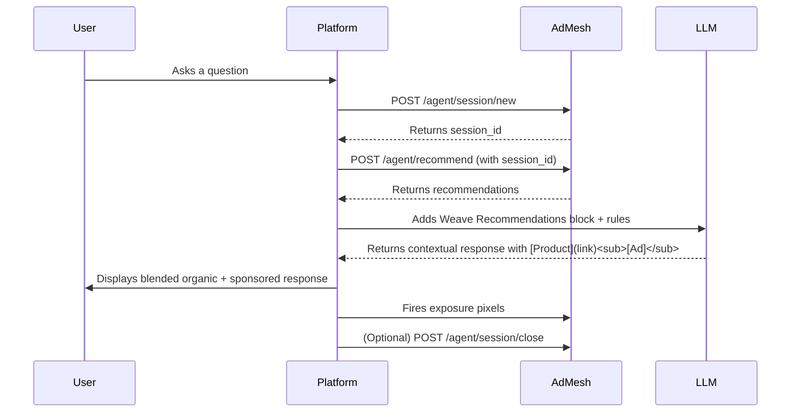
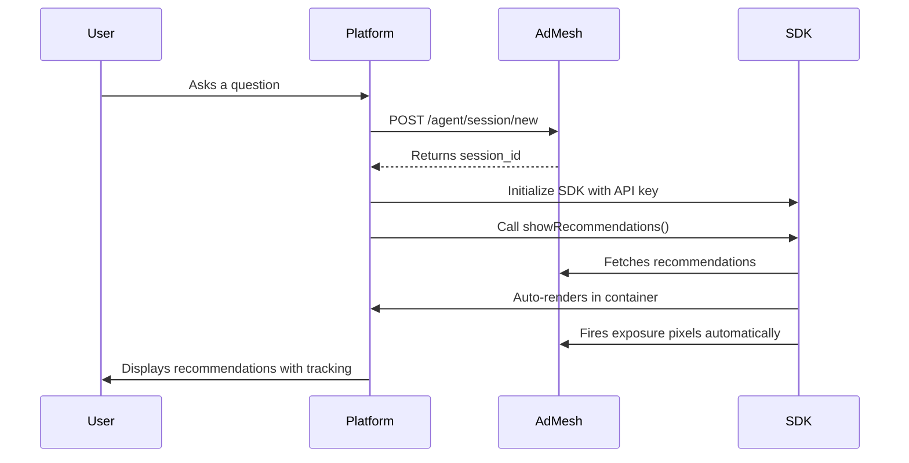

# Platform Overview

AdMesh lets AI platforms, chatbots, and search systems show **contextual sponsored recommendations** directly inside organic responses.
You control the UI, while AdMesh handles **ads, tracking, and attribution** behind the scenes.

---

## Choose Your Integration

AdMesh offers two complete integration formats. Pick one and follow the comprehensive guide:

| Format | Type | Best For | Setup |
|--------|------|----------|-------|
| **Weave Ad Format** | API-based | Custom conversational ads, LLM integration | Moderate |
| **Citation & Product Format** | SDK-based | Quick setup, automatic rendering | Minimal (3 steps) |

[Compare Formats →](/platforms/choose-integration)

---

## Quick Start

### For Weave Ad Format (API-Based)

Follow the complete end-to-end guide that includes:
- Creating sessions
- Fetching recommendations
- Formatting for your LLM
- Firing exposure pixels
- Closing sessions

[Start with Weave Ad Format →](/platforms/weave-ad-format)

### For Citation & Product Format (SDK-Based)

Follow the complete end-to-end guide that includes:
- Creating sessions
- Installing the SDK
- Adding a container
- Fetching and rendering recommendations
- Closing sessions

[Start with Citation & Product Format →](/platforms/citation-format)

---

---

## Integration Flows

### Weave Ad Format Flow

### Citation & Product Format Flow

---

## Key Features

✅ **Two Integration Formats** - Choose API-based or SDK-based
✅ **Complete Guides** - Each format has a comprehensive end-to-end guide
✅ **6 Language Examples** - TypeScript, React, Kotlin, Dart, Swift, React Native
✅ **Automatic Tracking** - Exposure pixels, clicks, and conversions
✅ **Transparency Built-in** - `[Ad]` labels included automatically
✅ **Session Management** - Group interactions per conversation
✅ **Error Handling** - Graceful degradation if AdMesh is unavailable

---

## Need Help?

- [Choosing Your Integration](/platforms/choose-integration) - Compare formats
- [FAQ](/platforms/faq) - Common questions and troubleshooting
- Email support: mani@useadmesh.com

---

## Platform Flexibility

**You can fully design your own UI** ,  grid, carousel, chat bubble, card layout, or anything else.
There's **no required AdMesh component**.

However, you **must label AdMesh recommendations clearly** so the exposure pixels can be triggered correctly when shown.

This means:
- Clearly identify the section or cards as **"AdMesh Recommendations"** (for transparency)
- Ensure we can detect when the AdMesh recommendations are actually visible ,  this is how exposure pixels are triggered

---

**Ready to start?** → [Create Session](/platforms/create-session)

