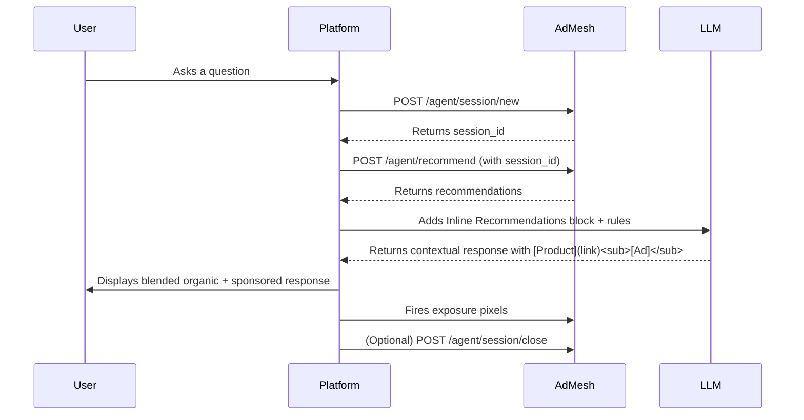

Follow these 5 steps to integrate AdMesh recommendations into your product.

| Step | Action | Docs |
|------|---------|------|
| 1️⃣ | **Create Session** ,  Start a new conversation context | [Create Session](/platforms/create-session) |
| 2️⃣ | **Get Recommendations** ,  Fetch contextual ads for a query | [Get Recommendations](/platforms/get-recommendations) |
| 3️⃣ | **Inline Recommendations** ,  Pass AdMesh offers to your LLM | [Weave Inline Recommendations](/platforms/inline-recommendations) |
| 4️⃣ | **Fire Exposure Pixels** ,  Track impressions when showing ads | [Fire Exposure Pixel](/platforms/fire-exposure-pixel) |
| 5️⃣ | **Close Session** ,  End or expire the session cleanly | [Close Session](/platforms/close-session) |

---

---

**Ready to start?** → [Create Session](/platforms/create-session)

